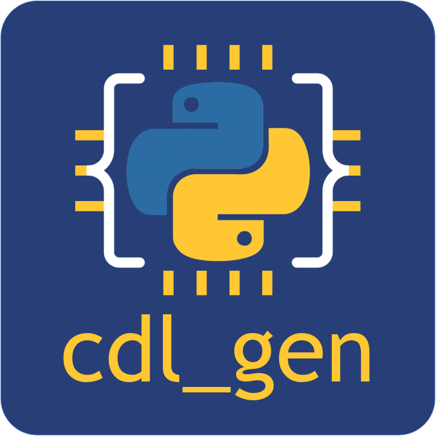

<p align="center">
  
</p>

# cdl_gen

**Python → CDL netlist → Virtuoso schematic.**

Describe a circuit in Python. `cdl_gen` writes the CDL (Circuit Description Language) netlist, imports it into a Cadence Virtuoso library with `spiceIn`, and generates the symbol.

- 📐 **Tidy schematics** — rebuilt from a JSON placement
- 🔁 **PDK-agnostic** — `techmap.json` controls the PDK-related global setup

<p align="center">
  <a href="https://www.youtube.com/playlist?list=PLGGVNEXMLFps">
    
  </a>
</p>

## Prerequisites

- **Python 3.9+**
- **Cadence Virtuoso**

Verify your environment before running:

```bash
which python3    # should return a Python 3.9+ path
which spiceIn    # should return the Cadence spiceIn path
which virtuoso   # must come from the same Cadence installation as spiceIn
```

If `spiceIn` reports `sysname returned an error status: unknown`, the shell's Cadence environment is not set up for this platform — source the correct one before running.

## Install

Git clone `cdl_gen` to your `virtuoso` directory (where you run `virtuoso`):

```
virtuoso/
├── cdl_gen/              # this repo
└── lib/                  # your library (created in Step 2)
    └── script.py         # your generator script
```

## Step 1 — Set Up the Process (`techmap.json`)

`techmap.json` holds every PDK-specific name. Nothing else in the repo does.

| Key | Meaning |
|---|---|
| `lib` | PDK library holding the primitives |
| `cells` | `{"nmos": "nmos1v", "pmos": "pmos1v"}` |
| `params` | `{"l": "l", "w_f": "fw", "n_f": "fingers", "w_tot": "w"}` |
| `defaults` | `{"l": "1u", "w_f": "1u", "n_f": 1}` |

You size devices with general names; `params` translates them:

| Name | Meaning |
|---|---|
| `l` | length |
| `w_f` | width of one finger |
| `n_f` | number of fingers |
| `w_tot` | total width — optional, computed as `w_f` × `n_f` |

Add `w_tot` only if your PDK has a total-width parameter. `cdl_gen` writes CDF values directly, so the PDK never computes it for you.

#### Find your PDK's names

Dump the CDF in the CIW (a typical NMOS in your PDK is enough). In this example, `gpdk045` and `nmos1v` are used. Library and device names are different across processes (e.g., tsmc 65nm), so you need to manually set it.

```scheme
load("./cdl_gen/cdl_gen.il")
cdlgenDumpCDF("gpdk045" "nmos1v")
```

Each line reads `name  type=  value=  prompt=`. **You need to check which parameters are used in your PDK** — `w` could be the finger width in one PDK and the total width in another. Add `t` as a third argument for full detail.

## Step 2 — Generate a Circuit

**Create a library** to generate into. `newlib.py` binds the PDK techfile named in `techmap.json`, so Step 1 must be done first:

```bash
python3 cdl_gen/newlib.py lib
```

`lib` is used as an example throughout this README. Creating it by hand in *Library Manager* works too — attach the PDK as its technology library, or CDF parameters will not display.

**Copy a template** into your library — the script *and* its placement. `ota_5t` is a good starting point:

```bash
cp cdl_gen/templates/ota_5t/ota_5t.py   lib/my_ota.py
cp cdl_gen/templates/ota_5t/ota_5t.json lib/my_ota.json
```

**Set the cell name** inside the script: `cell = "my_ota"`.

> **Naming rule:** script, placement, and `cell` must all match — `my_ota.py`, `my_ota.json`, `cell = "my_ota"`. `cell` is the only line to edit: the netlist (`f"{cell}.cdl"`) and the placement lookup (`f"{cell}.json"`) both derive from it.

**Run it** from your `virtuoso` directory:

```bash
python3 lib/my_ota.py
```

**Refresh** *Library Manager* (**View** → **Refresh**, or `cdlgenRefresh()` in the CIW — see [CIW Helpers](#ciw-helpers)). The generated schematic now appears under your `lib`.

## Quick Start

Every script has numbered sections. Edit **Section 2** only:

```python
"""
1. Initialize (do not edit)
"""
# boilerplate

"""
2. Write a Netlist (edit this section)
"""
cell = "my_ota"
nin  = dict(l="1u", w_f="2u", n_f=2)              # input pair sizing

ckt = cdl_gen.subckt(name=cell, pins=["VDD", "VSS", "VINP", "VINN", "VBIAS", "VOUT"])
ckt.add_device(cdl_gen.device(name="M1", model=nmos,
                              terminals=["DIODE", "VINP", "TAIL", "TAIL"], **pdk(nin)))
# ... M2 - M5

"""
3. Tidy schematic placement (edit when necessary)
"""
tidy = True                                       # reads my_ota.json

"""
4. Generate (do not edit)
"""
# boilerplate
```

Terminals are `[D, G, S, B]`. Sizing lives here, never in the `.json`. A script without a placement stops at Section 3 (*Generate*).

### Tidy Schematic Placement

`spiceIn` imports connectivity but not placement, so schematics come out tangled. `<cell>.json` describes a clean one:

| Block | Holds |
|---|---|
| `place` | `instances`, `pins` |
| `wire` | `wires`, `rails`, `diodes`, `ports` |

**A net is named by the pin on it.** Give every net that needs a name a `ports` or `rails` entry; the rest become `net1`, `net2`, ...

Instances name their master as `{"device": "nmos"}` (resolved via `techmap.json`) or `{"lib": ..., "cell": ...}`.

Set `tidy = False` in the script to skip placement.

#### Keep your hand edits

Edit the schematic in Virtuoso, then:

```bash
python3 cdl_gen/extract.py <lib> <cell>
```

This writes a `wire_ext` block into `<cell>.json`, leaving `place` and `wire` untouched. `wire_ext` wins when present — delete it to go back.

### Options

| Flag | Description |
|---|---|
| `--scratch` | Delete existing cells in the library before importing |
| `--topsym` | Generate a Virtuoso symbol view for the top-level cell |

```bash
python3 lib/script.py                    # import into existing library
python3 lib/script.py --scratch          # wipe cells first, then import
python3 lib/script.py --topsym           # also generate top cell symbol
python3 lib/script.py --scratch --topsym # both
```

## CIW Helpers

`cdl_gen.il` adds SKILL helpers for the Virtuoso CIW. An already-open session only sees external `cdl_gen` changes (`newlib.py`, `spiceIn`) after a refresh. Load the helper in the CIW:

```scheme
load("./cdl_gen/cdl_gen.il")
```

To automate this, add that `load(...)` line at the end of `./.cdsinit` so the helper is available in every session without loading it by hand.

Then, after running a generator script:

```scheme
cdlgenRefresh()
```

| Function | Description |
|---|---|
| `cdlgenRefresh()` | Full *Library Manager* refresh from disk (same as **View** → **Refresh**) |
| `cdlgenDumpSym(lib cell)` | Print a symbol's shapes, labels, and pins |
| `cdlgenDumpCDF(lib cell [full])` | Print a cell's CDF parameters (name/type/value/prompt; `full` prints every slot) |
| `cdlgenCheckTech(lib)` | Report the technology library bound to `lib`, compared with `techmap.json` |
| `cdlgenDumpNets(lib cell)` | Print each net, its terminals, and whether it is a pin |
| `cdlgenSetFingers(lib cell)` | Toggle each device's finger count (from `techmap.json`) so PDK total width recomputes |

The remaining helpers (`cdlgenDrawSym`, `cdlgenPlaceSch`, `cdlgenDumpSch`, `cdlgenTermXY`, `cdlgenTermPts`, `cdlgenDiode`, `cdlgenPortStub`, `cdlgenTechParam`) are invoked in batch by `drawsym` / `placesch` / `extractsch`; you don't call them by hand.

## Core API

| Class / Function | Description |
|---|---|
| `cdl_gen.device(name, model, terminals, **params)` | A single SPICE device instance (e.g., cap, res, ind) |
| `cdl_gen.subckt(name, pins, params=None)` | A `.SUBCKT` block containing devices (`params` adds `name=default` to the header) |
| `subckt.add_device(device)` | Add a device to a subcircuit |
| `cdl_gen.techmap()` | Load `techmap.json` (the process map) |
| `cdl_gen.pdkparams(sizing)` | Map general sizing (`l`, `w_f`, `n_f`) to PDK param names, deriving `w_tot` when mapped |
| `cdl_gen.reflib_list` | Libraries passed to `spiceIn -reflibList` (append the PDK lib to instantiate its cells) |
| `cdl_gen.createlib(lib_name, tech=None)` | Create a Virtuoso library and register it in `cds.lib` (idempotent) |
| `cdl_gen.pathsetup()` | Resolve module name and working directories from the calling script |
| `cdl_gen.write_cdl(filename)` | Serialize all subcircuits to a `.cdl` file |
| `cdl_gen.scratchstart(lib_dir)` | If `--scratch` is set, wipe existing cells in the library |
| `cdl_gen.spicein(cdl, work_dir, lib_dir)` | Run Cadence `spiceIn` to import the netlist |
| `cdl_gen.topsymgen(cell_name)` | If `--topsym` is set, generate a Virtuoso symbol view |
| `cdl_gen.drawsym(cell, spec)` | Draw a custom symbol from `templates/<spec>_sym.json` |
| `cdl_gen.placesch(cell, placement, params=None)` | Rebuild a schematic cleanly from a placement (dict, JSON path, or `None`); `params` sets per-instance CDF values |
| `cdl_gen.extractsch(cell)` | Snapshot a hand-edited schematic into the `wire_ext` block of `<cell>.json` |
| `cdl_gen.del_pycache(script_dir)` | Remove `__pycache__` left by the generator script |

## Device Mapping

The file `devmap.txt` maps SPICE primitives to Cadence device types:

```
resistor  → res
capacitor → cap
inductor  → ind
```

## Templates

| File | Description |
|---|---|
| `templates/cap.py` | Simple single capacitor |
| `templates/cap_dac/` | 3-bit binary-weighted capacitor DAC with Gaussian mismatch and clean placement |
| `templates/ota_5t/` | 5-transistor OTA built from PDK devices (see below) |

### OTA Example (`templates/ota_5t/`)

`ota_5t.py` + `ota_5t.json` build a 5-transistor OTA straight from the PDK cells named in `techmap.json` — see [Step 2](#step-2--generate-a-circuit) to run it.

It is the reference for a full placement: `ports` for every pin, a `diodes` entry for the mirror, terminal-anchored `wires`, and per-instance sizing passed as `params`. Device sizes live in the script (`w_f`, `n_f`), never in the `.json`.

`ota_5t_beta.py` is the same circuit built from `cdlgenPrim` wrapper cells instead of PDK cells — unverified, kept for reference.
